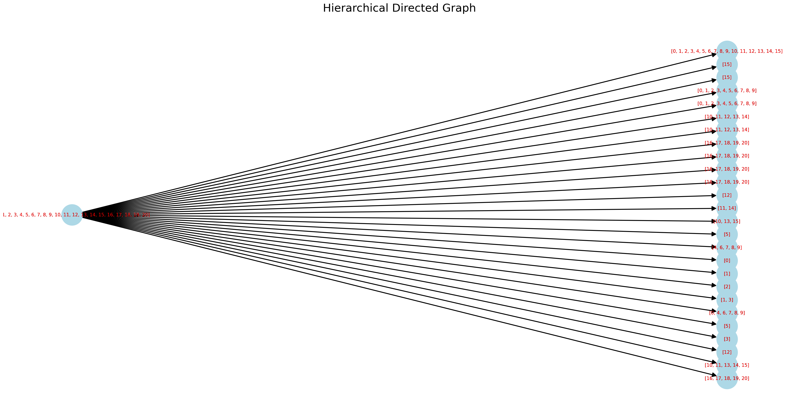
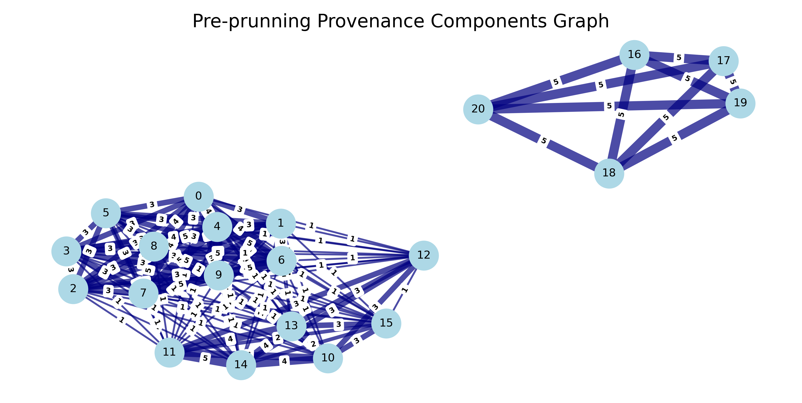
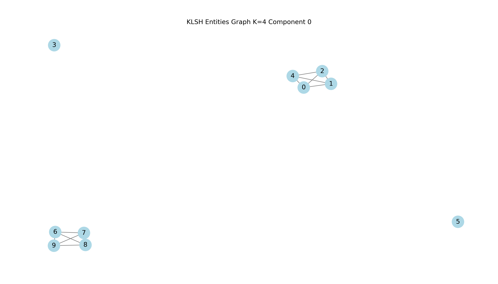

# Entity Resolution - Meta-Blocking and KLSH

## Project:
This repo sub-directory is part of a set of projects to explore the capabilities of ML/AI methods in entity resolution problems. It aims at solving deduplication and the identification of diverse records to group their corresponding entity.

The methodology and its implementation is described in more detail in this blog ["Entity Resolution: Meta-Blocking and KLSH"](https://app.readytensor.ai/publications/entity-resolution-meta-blocking-and-klsh-3hz55CPSvHPs).

The project is an experimental prototype for research and does not address full error handling or production standards, and it's rather a setup for quick prototyping

The proposed approach has three sequential stages. Firstly the generation of a hierarchical graph for records in blocks, followed by the generation of a record relationship graph with components; finally we cluster the records for each component using a K-Means algorithm, an approach we refer herein as KLSH.

- *Hierarchical graph*: We build a hierarchical directed graph where each level corresponds to blocks generated from a blocking rule/s.
  - Each block in a graph level groups co-occurring records in blocks based on a rule. Hierarchical rules applied to blocks yield children blocks at deeper graph levels.



- *Record Relationship graph*: Two records in a block is referred as that they co-occur and this relationship is represented as an edge between these two records. We graph co-ocurrence and edges in a record relationship graph where we refer to records as nodes.
  - In this record relationship graph, components are formed when a group of nodes are all connected to each other, either directly, or indirectly through other nodes.
  
  
  
  - We increase the count of a node edge for each co-ocurrence. This weight metric signals the strenth of a relationship between records.
  - We prune components according to a threshold number of edge count between nodes.

  

The generation of clustering components reduces all dataset record comparisons which is an O(n) to O(n) thus reducing the computational requirements for downstream processing since we would only be comparing records within components; the approach helps us present a reasonable scalable solution.

```python
Assuming 1000 records, from n*(n-1)/2 = 1000*999/2 = 499,500 comparisons without blocking
to
assuming 100 components evenly split with 10 records each, 10*9/2=45 comparisons per component
45 * 100 components = 4500

== That's over 110x reduction in comparisons ==
```

- *KLSH:* Component records are broken down into clusters applying a K-Means algorithm, the approach of which is referred herein and inspired by existing [literature](https://arxiv.org/pdf/1810.05497) as KLSH.
  - K-means is helpful in that it can place records that are similar in the same bucket or cluster but apart from those that are different; the approach treats each cluster as a bucket mimicking LSH though it doesn't use hashing. 
  - We apply and optimize the weights of transformed record features via Bayesian Optimization with objective function targeting the average of all components' results F1=1. These features are inputs to a Kmeans algorithm to calculate the square ecludian distances to centroids and cluster records.
  - The resulting records in a component are broken down into clusters applying KMeans, referred herein and existing [literature](https://arxiv.org/pdf/1810.05497) as KLSH.

  

The process results in an entity resolution result for the dataset of F-1/Precision/Recall=0.952/1.00/0.916.

<p>&nbsp;</p>

## Project Publication Post:
Read this [blog](https://app.readytensor.ai/publications/entity-resolution-meta-blocking-and-klsh-3hz55CPSvHPs) for a description of the approach and its implementation.

<p>&nbsp;</p>

## Usage
1. Execute the program
```python
$ python manager.py
``` 
2. Enter the ground truth tuple pairs as a list in config.py, e.g:
```python
ground_truth_pairs_component_0 = [(0, 1), (0, 2), (0, 3), (0, 4), (1, 2), (1, 3), (1, 4), (2, 3), (2, 4), (3, 4),
                        (6, 7), (6, 8), (6, 9), (7, 8), (7, 9), (8, 9)]
```
3. Block and generate KLSH clusters by:
```python
   - set: config.uniform_weights_klsh = True
   - set a component index, e.g: config.component_idx = 0
```

4. Run bayesian optimization to find custom weights across all components:
```python
   - set: config.uniform_weights_klsh = False
   - set: config.bayesian_optimization_klsh = True
```

5. Test the optimized weights:
  - enter the bayesian optimization optimized weights:
```python
  config.best_weights = [0.32922948, 0.36130566, 0.20008195, 0.82066852, 0.44855293, 0.62657605, 0.36378109, 0.4405338, 0.2413675]
```
  - generate the updated clusters for a component based on the optimized weights:
```python
  - set: config.uniform_weights_klsh = False
  - set: config.bayesian_optimization_klsh = False
  - set: config.test_optimized_weights_klsh = True
  - set a component index, e.g: config.component_idx = 0
```

<p>&nbsp;</p>

## Dataset
A small imaginary and manually produced dataset of 20 piano models that have 7 features with types including string, date, numeric and ordinal categories. It's is stored in /data.

<p>&nbsp;</p>

## Tools & Libraries
Graphs leverage networkx and pygraphviz libraries.
Flexibility is built to create blocking rules based on soundex and metaphone.

<p>&nbsp;</p>

## Installation
You can execute requirements.txt. Tested on Python 3.13.3.

pygraphviz can be tricky to install, I found this command useful:
```python
conda install -c conda-forge pygraphviz
```

<p>&nbsp;</p>

## Repo structure
<pre>
C:.
│   config.py          # config variables
│   context.py         
│   manager.py         # Main controller script  
│   requirements.txt   
│
├───blocking           # Blocking scripts and rules  
├───clustering         # KLSH clustering engine  
├───data               # Dataset  
├───features           # Feature engineering scripts  
├───graphs             # Graph images  
└───optimization       # Bayesian optimization script  
</pre>

<p>&nbsp;</p>

## License
This project is licensed under the MIT License. See LICENSE.txt for more information.

<p>&nbsp;</p>

## Contact
For questions or collaborations please reach out to sergiosolorzano@gmail.com


<p>&nbsp;</p>

If you find this helpful you can buy me a coffee :)

<a href="https://www.buymeacoffee.com/sergiosolorzano" target="_blank"></a>      
