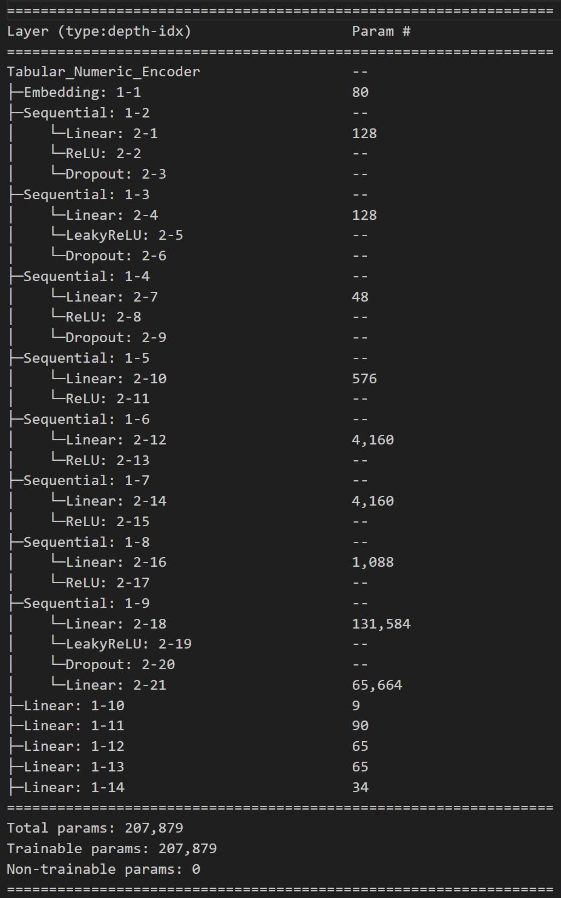
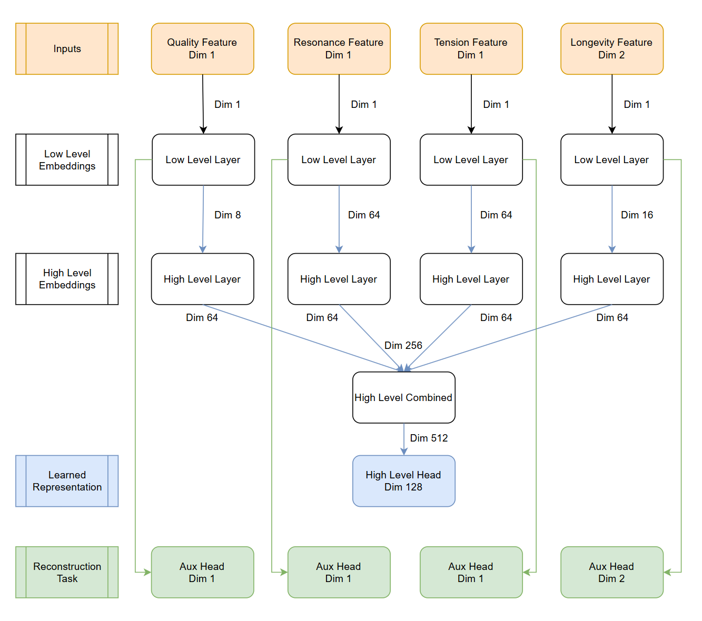

# Project
As part of our experimentation with methods for entity resolution tasks, I perform an exploration of the usefulness of a feed forward network's learned representations of record features for tabular data which serve as inputs for an entity resolution clustering algorithm.

The network architecture, experiements, results and references are documented in in this publication ["Entity Resolution: Learned Representations of Tabular Data with a Classic Neural Network"](https://app.readytensor.ai/publications/entity-resolution-learned-representations-of-tabular-data-with-classic-neural-networks-MtUrsAPP6Mdt).

The code project is an experimental prototype for research and does not address full error handling or production standards, and it's rather a setup for quick prototyping.

# Methodology
Our approach aims at generating embeddings of record features with a neural network which will serve as inputs to a hierarchical clustering algorithm to clusters records.

We choose a [siamese](https://www.baeldung.com/cs/siamese-networks)-like feed-forward neural network. It aims at setting entities apart in the representation space and based on the similarity of each record's feature embeddings. We calculate similarity by manipulating distance to reflect similarity. 
```python
sim_anchor_pos = torch.clamp(1 - dist_anchor_pos / margin, min=0, max=1)
```
We take a supervised training approach using a dual loss criterion: MSE loss on numeric and cross-entropy on category reconstructed feature values; TripletMarginLoss/ContrastiveLoss criterion on learned representation ecludean distances, albeit implicitly this helps us gauge a measure for similarity [*"This is used for measuring a relative similarity between samples."*](https://docs.pytorch.org/docs/stable/generated/torch.nn.TripletMarginLoss.html).

Our training and evaluation datasets contain multiple sets, referred as triplets, with three records each: an *anchor* or a base record; a record somewhat similar to the anchor referred as a *positive*, and a third dissimilar to the first two and referred as a *negative*.  Each record is a piano model. It's therefore worth noting that an epoch trains the model and generates embeddings for each triplet record separately but with the same model and shared parameters.

We compute how far these records are represented in the embedding space and a loss is calculated by the TripletMarginLoss/ContrastiveLoss criterion which changes model gradients to get those similar closer or push apart those different subject to a margin threshold.

Based on our results and [existing literature](https://wcxie.github.io/Weicheng-Xie/pdf/ICIP2019.pdf), we further refine the training approach by selecting harder records based on their distance.

We add an auxiliary reconstruction head for each feature in the network to keep track that the information for each feature in the representation space is preserved.

Finally, the resulting encoder learned representations from the model become an input to a [hierarchical clustering algorithm](https://scikit-learn.org/stable/modules/generated/sklearn.cluster.AgglomerativeClustering.html) and we compare these results to ground truth. Thus we will often refer herein to the neural network as an encoder in that it generates embedding inputs where hopefully semantically similar records are placed together in the representation space, and those different far apart.

# Network Architecture
## Encoder
Siamese-like feed-forward neural network.

### Loss Criterion
We apply the sum of two loss criterions to train the model.
- Record distance loss
- Feature reconstruction task Loss

### Model Summary and Layer Architecture




### Scheduler and Optimizer
- [CyclicLRWithRestarts Scheduler](https://arxiv.org/abs/1711.05101)
- [optim.AdamW](https://pytorch.org/docs/stable/generated/torch.optim.AdamW.html)

### Regularization
We apply dropout = 0.3 on the early layers.

To avoid overfitting we further apply weight decay on all layers with values between 0.00001 to 0.000005, except for the combined layer 0.01 which we observe memorizes the training data.

# Datasets
Both training and evaluation datasets are imaginary and were created using a spreadsheet and rules to establish record features distance. The training dataset counts with over 13,000 triplets or over 40,000 piano records. The evaluation dataset counts with over 2400 triplets or over 7000 records. 
Our test dataset contains 10 records which are two piano models and we aim to separate these records by model.

We use the data rules mentioned above to generate a positive and a negative record from an anchor to which we add small variations. This produces two groups of 5 records each for ground truth, one reflecting positive records and another for negative records. We expect the clustering algorithm to results in two clusters.

We add some records to the testing dataset to generate an testing enhanced dataset. We do this by changing one feature in record 0 of the Test dataset and add these rows (10-13) to the test dataset. Record 14 is a variation of the second piano model (quality feature is changed) in the test dataset.

# Project Directory
I have create a sub-directory for each of the three loss criterion variation implementations:

| |  |
|--------|---------|
| Directory | Description |
| contrastive | Model trained with Contrastive Loss Margin Criterion |
| triplet_loss_margin | Model trained with Triplet Loss Margin Criterion |
| triplet_loss_margin_mining | Model trained with Triplet Loss Margin Criterion and Hard-negative mining samples |

# Usage
Model Settings:
- Training (Evaluation occurs at epoch intervals) toggled at config.run_inference_hierarchical_clustering = False
- Set number of training epochs at config.tne_train_epoch = #
- Set loss function at config.loss_function = choose "contrastive" "tripletmargin" or "tripletmargin_mining"
- To run Inference on a test dataset set config.run_inference_hierarchical_clustering = True

Running the script:
1. cd to the desired experiment directory (e.g. contrastive)
2. Execute the program
	$ python m_manager.py
3. Results:
- logs shown on terminal
- plots directory/
	- distance_distrib_Train_e_X.png shows training embeddings anchor-positive and anchor-negative distance distributions
	- distance_distrib_Eval_e_X.png shows eval embeddings anchor-positive and anchor-negative distance distributions
	- training loss evolution plot
	- auroc and confusion matrix plots
	- cvs with eval and training metrics
- Set your ffmpeg.exe path at config.embed_mp4 = r"C:\ProgramData\miniconda3\envs\entity-rel\Library\bin\ffmpeg.exe"

# Conda env considerations:
To install torch, +cu128 worked for me: pip install --pre torch==2.8.0.dev20250325+cu128 torchvision==0.22.0.dev20250325+cu128 torchaudio==2.6.0.dev20250325+cu128 --index-url https://download.pytorch.org/whl/nightly/cu128

## Project Publication Post:
Read this [blog](https://app.readytensor.ai/publications/entity-resolution-learned-representations-of-tabular-data-with-classic-neural-networks-MtUrsAPP6Mdt) for a description of the approach and its implementation.

<p>&nbsp;</p>

## License
This project is licensed under the MIT License. See LICENSE.txt for more information.

<p>&nbsp;</p>

## Contact
For questions or collaborations please reach out to sergiosolorzano@gmail.com

<p>&nbsp;</p>

If you find this helpful you can buy me a coffee :)

<a href="https://www.buymeacoffee.com/sergiosolorzano" target="_blank"></a>      